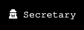
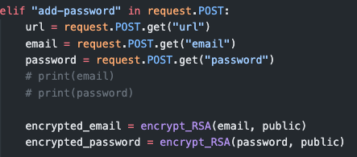
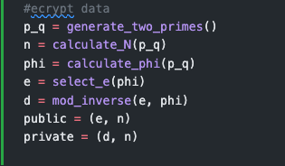
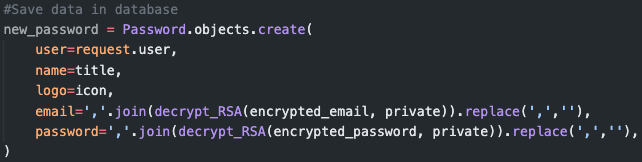
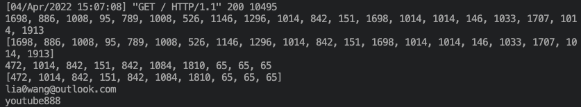
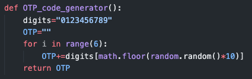
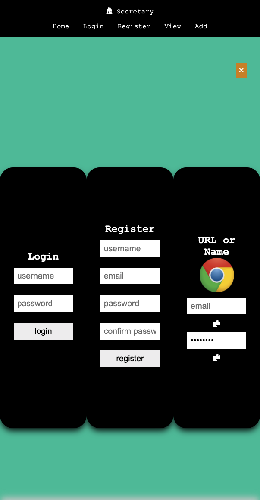

# Secretary: A web app Password Manager

*my something-awesome-project for COMP6441*

## Ideas

- A simple password manager python script is not enough for me
- But I haven't completely learned html and css yet
- So I searched some open sources projects and found the most suitable one that inspired me: https://www.youtube.com/watch?v=z87LjWauDvI

## Changes I made

- Improve the algorithm and methods for the password security
  
  - Implemented the **RSA algorithm** in the **rsa.py** inside the **secretary** folder and
    - Import them to the backend, 
    - Encrypt the passwrod and email and store the encrypt info into Database
    - 
    - 
    - Decrypt them when extracting them from the Database
    - 
    - Succeed output:
      - , where
      - The 1st two lines are **encrypt email** using **RSA**,
      - The 2nd two lines are **encrypt password** for Youtube
      - The final two lines are **decrypt email and password**

- Wrote my own **OTP Generator** and use **HOST=OUTLOOK**
  
  - 

- Wrote automation tests to test the api of the password manager

- For the frontend:
  
  - Use my own design for the UI
  - Update the main.js to fix bugs that:
    - When switching modals from one to another, the modal that was open before is not closed:
    - 

## What to achieve:

- [ ] A web app password manager that can be used on any device
  
  - [ ] Make a deployment on a server

- [x] People are able to interact with it through the UI
  
  - [x] Implement front-end

- [x] The password manager should be secure
  
  - [x] Use **RSA** algorithm and methods for the password security in the backend

- [x] The web app should has following functions:
  
  - [x] **Login**
    - [x] Return msg when username or password is incorrect
    - [x] Use **OTP** (HOST is outlook) to send confirmation email
      - [x] Return msg when verifitation failed
      - [x] Return msg when verification succeeded
  - [x] **Register**
    - [x] Return msg when duplicated username
    - [x] Return msg when passwords do not match
    - [x] Return msg when duplicated email
    - [x] Welome msg when register successfully
  - [x] **Logout**
    - [x] Return msg when loggout
  - [x] **Add a new password**
    - [x] Use **RSA** algorithm to encrypt the email and password when save them to DB
    - [x] Use **RSA** algorithm to decrypt the encrypt email and password when extract them for view the stored passwords
    - [x] Return msg when add a password succeed
    - [x] For each stored password, find the coresponding website Icon
  - [x] Delete a password
    - [x] Return msg when delete a password succeed

## Requirements

See **requirements.txt**