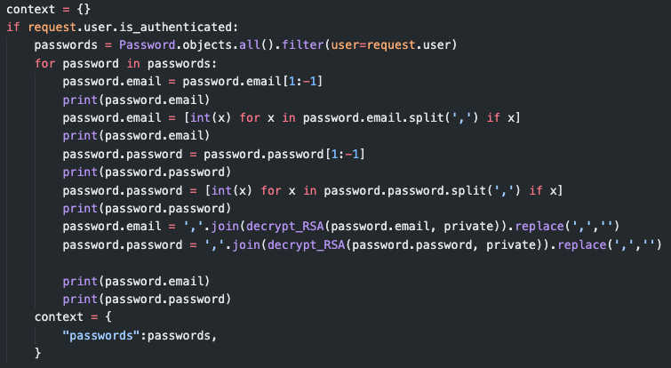

<p align="center"></p>

# Secretary: A web app Password Manager

***my something-awesome-project for COMP6441***

***link:*** https://secretary-password-manager.herokuapp.com/

## Ideas

- A simple password manager python script is not enough for me
- But I haven't completely learned html and css yet
- So I searched some open sources projects and found the most suitable one that inspired me: https://www.youtube.com/watch?v=z87LjWauDvI

## Changes I made

### Backend

- [x] Improve the password security by using **RSA algorithm**
  
  - [x] Import it to the backend
    
    - 
  
  - [x] Encrypt the passwrod and email and store the encrypt info into Database
    
    - 
    - 
    - 
  
  - [x] Decrypt them when extracting them from the Database
    
    - 
  
  - [x] Succeed output:
    
    - 
      
      - The 1st two lines are **encrypt email** using **RSA**,
      - The 2nd two lines are **encrypt password** for Youtube
      - The final two lines are **decrypt email and password**

- [x] Wrote my own **OTP Generator**

- [x] Use **HOST=OUTLOOK**
  
  - 

### Frontend

- [x] Use my own design for the UI
- [x] Update the script.js to fix bugs that:
  - When switching modals from one to another, the modal that was open before is not closed:
  - 

### Testing

- [x] Wrote automation tests using selenium to test the API
  - [x] Login
    - [ ] Enter the wrong user name
    - [ ] Enter the wrong password
  - [x] Register
    - [ ] Enter different password into the confirmation box
    - [ ] Enter invalid email
    - [ ] Register the same username and email twice
  - [x] Logout
  - [x] Add a new password
    - [x] Add multiple passwords
    - [x] Examine if the stored password and email are correct
  - [x] Delete a pass word

### Deployment

- [x] Make a deployment on Heroku

## What to achieve

- [x] **UI Design** - People are able to interact with it

- [x] **Security** - Use **RSA** algorithm for the password security

- [x] **Login**
  
  - [x] Return msg when username or password is incorrect
  - [x] Use **OTP** (HOST is outlook) to send confirmation email
    - [x] Return msg when verifitation failed
    - [x] Return msg when verification succeeded

- [x] **Register**
  
  - [x] Return msg when duplicated username
  - [x] Return msg when passwords do not match
  - [x] Return msg when duplicated email
  - [x] Welome msg when register successfully

- [x] **Logout**
  
  - [x] Return msg when loggout

- [x] **Add a new password**
  
  - [x] Use **RSA** algorithm to encrypt the email and password when save them to DB
  - [x] Use **RSA** algorithm to decrypt the encrypt email and password when extract them for view the stored passwords
  - [x] Return msg when add a password succeed
  - [x] For each stored password, find the coresponding website Icon

- [x] **Delete a password**
  
  - [x] Return msg when delete a password succeed

## Requirements

```python
pip3 install -r requirements.txt
```